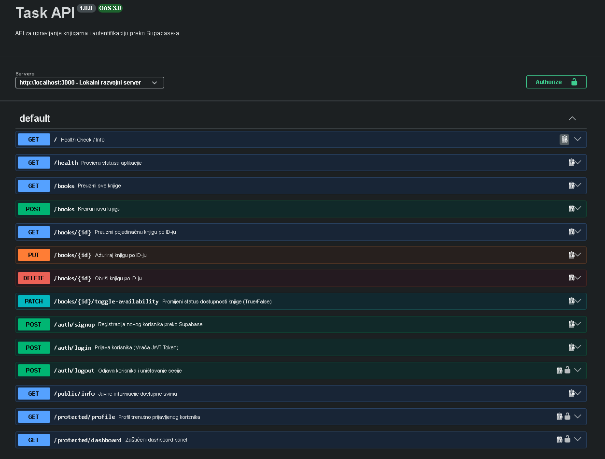

# Task API - Book Management & Authentication System

A secure Node.js/Express API for managing a book library, integrated with PostgreSQL and Supabase Auth. This project features user authentication (Sign Up, Log In, Log Out), JWT token verification via custom middleware, a database rate-limiter, and complete OpenAPI documentation via Swagger UI.

---

## 🚀 Features

- **User Authentication:** Handled securely via Supabase Auth (Sign Up, Login, and Session Logout).
- **Route Guarding:** Reusable middleware that extracts and validates JWT `Bearer` tokens from HTTP headers.
- **Database & Seeding:** PostgreSQL integration using `pg.Pool` with automatic schema creation and initial data seeding.
- **Rate Limiting:** IP-based "Gatekeeper" middleware that logs requests and blocks potential bots (max 5 requests per 10 seconds).
- **Interactive Documentation:** Fully documented API endpoints accessible via Swagger UI.
- **Dockerized Environment:** Modern setup utilizing Docker Compose v2 for multi-container orchestration.

---

## 🛠️ Prerequisites & Tech Stack

- **Node.js** (v18+) & **Express**
- **PostgreSQL**
- **Supabase** (Identity Provider)
- **Docker & Docker Compose v2**
- **Swagger UI Express**

---

## 📦 Environment Setup

Secrets and configurations are strictly isolated inside a git-ignored `.env` file. Create a `.env` file in the root directory of your project based on the template below:

### `.env.example`

```text
PORT=3000
SUPABASE_URL=your_supabase_project_url
SUPABASE_KEY=your_supabase_anon_public_key
POSTGRES_USER=your_db_user
POSTGRES_PASSWORD=your_db_password
POSTGRES_DB=your_db_name
POSTGRES_HOST=db
POSTGRES_PORT=5432
```

---

## ⚙️ How to Run

The entire infrastructure (Node.js application and PostgreSQL database) is fully automated using Docker Compose.

1. Clone the repository:

```bash
git clone [https://github.com/YOUR_USERNAME/YOUR_REPO_NAME.git](https://github.com/YOUR_USERNAME/YOUR_REPO_NAME.git)
cd YOUR_REPO_NAME
```

2. Spin up the containers:

```bash
docker compose up --build
```

_Note: The application includes a 5-second initialization delay to ensure the PostgreSQL service is fully healthy and ready before migrating schemas and seeding data._

3. Stop the services:

```bash
docker compose down
```

---

## 📖 API Reference & Auth Requirements

| Method | Endpoint                       | Description                                  | Auth Required? | Status Code        |
| ------ | ------------------------------ | -------------------------------------------- | -------------- | ------------------ |
| GET    | /                              | Health Check / API Info                      | NONE           | 200                |
| GET    | /health                        | Server Health Status                         | NONE           | 200                |
| POST   | /auth/signup                   | Register a new user account via Supabase     | NONE           | 201, 400, 500      |
| POST   | /auth/login                    | Authenticate user & return JWT tokens        | NONE           | 200, 401           |
| POST   | /auth/logout                   | End user session and invalidate server token | Bearer Token   | 204, 401           |
| GET    | /public/info                   | Open public information endpoint             | NONE           | 200                |
| GET    | /protected/profile             | Fetch current user safe metadata             | Bearer Token   | 200, 401           |
| GET    | /protected/dashboard           | Secure user dashboard panel                  | Bearer Token   | 200, 401           |
| GET    | /books                         | Retrieve a list of all books                 | NONE           | 200, 249, 500      |
| GET    | /books/:id                     | Fetch details of a single book by ID         | NONE           | 200, 404, 500      |
| POST   | /books                         | Add a new book to the library                | NONE           | 201, 400, 500      |
| PUT    | /books/:id                     | Update all fields of a specific book         | NONE           | 200, 400, 404, 500 |
| PATCH  | /books/:id/toggle-availability | Invert the availability status of a book     | NONE           | 200, 404, 500      |
| DELETE | /books/:id                     | Remove a book from the database              | NONE           | 204, 404, 500      |

---

## 🎨 Interactive API Documentation (Swagger UI)

The API documentation is fully interactive and supports live testing using real authentication headers.

URL: **http://localhost:3000/api-docs**

### How to test protected routes inside Swagger:

1. Hit the POST /auth/login endpoint with valid credentials to obtain your access_token[cite: 1].

2. Click the green Authorize button at the top of the Swagger page[cite: 1].

3. Paste the JWT string inside the text input and save (Swagger automatically formats the Bearer prefix)[cite: 1].

4. Locked endpoints with a padlock icon will now execute successfully using your dynamic session token[cite: 1]!

### Swagger UI Screenshot



---

## 🔒 Security Best Practices Implemented

1. **No Password Hashing Roll-Your-Own:** Industry standard encryption and cryptographic hashing are completely outsourced to Supabase Auth.
2. **Stateless JWT Checks:** The authentication guard reads, trims, and validates incoming JSON Web Tokens dynamically via network calls to the Identity Provider without local state manipulation.
3. **Environment Security:** Plaintext configuration tokens and access codes are strictly omitted from git trees using strict .gitignore patterns
